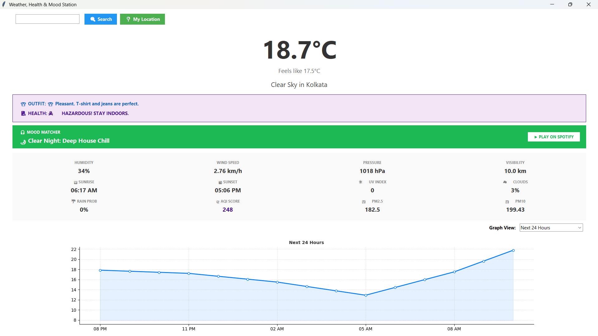

# Weather_app_by_python
Weather, Health & Mood Station 🌦️🏥🎧
A comprehensive, interactive Desktop GUI application built with Python. This tool goes beyond basic weather reporting by integrating Health Safety (AQI), Smart Outfit Suggestions, and a Weather-Based Music Matcher that connects directly to Spotify.

## 🌟 Features
Real-Time Weather Data: Fetches current temperature, humidity, wind speed, pressure, and visibility using the OpenWeatherMap API.

## Smart Advice Engine:

👕 Outfit Planner: Suggests clothing based on temperature, rain probability, and UV index.

🏥 Health Monitor: Analyzes Air Quality Index (AQI) and PM2.5 levels to provide health warnings (e.g., "Wear a mask").

🎧 Music Mood Matcher: Automatically detects the "vibe" of the weather (e.g., "Rainy Night", "Sunny Pop") and generates a clickable link to a relevant Spotify search.

Interactive Analytics:

Embedded Matplotlib graph to visualize temperature trends.

Forecast: View trends for the Next 24 Hours (interpolated) and Next 5 Days.

Note: "Previous 24 Hours" and "Last Month" views use simulated data for demonstration.

Detailed Metrics: Includes Sunrise/Sunset times, Cloud Cover %, and estimated UV Index.

Geolocation: precise weather fetching via City Name search or Auto-Geolocation (IP-based).

## 🛠️ Prerequisites
To run this application, you need Python 3.x installed on your system. You also need to install a few external libraries.

1. Install Dependencies
Open your terminal or command prompt and run:

Bash

pip install requests matplotlib numpy
(Note: tkinter, datetime, random, and webbrowser are included in the standard Python library.)

2. Get an API Key
This app uses the OpenWeatherMap API.

Go to OpenWeatherMap.org.

Sign up for a free account.

Navigate to "My API Keys" and copy your key.

Open the Python script (weather_app.py) and locate line 11:

Python

API_KEY = "your_openweathermap_api_key_here"
Replace the placeholder text with your actual key.

## 🚀 How to Run
Navigate to the directory containing the script.

Run the file:

Bash

python weather_app.py
The GUI window will appear. Enter a city name (e.g., "London", "Mumbai") and press Enter or click Search.

## 📸 Screenshots

## 📂 Project Structure
GUI Framework: Built using tkinter and ttk for a native, responsive desktop feel.

Data Visualization: Uses matplotlib.backends.backend_tkagg to embed live charts directly into the Tkinter window.

Data Processing: * numpy: Used for interpolating data points to create smooth hourly curves for the "Next 24 Hours" graph.

requests: Handles asynchronous API calls to OpenWeatherMap.

Logic:

calculate_music_mood(): Maps weather condition codes (IDs) to music genres.

calculate_aqi(): Converts raw PM2.5 data into a standard AQI scale.

estimate_uv(): Algorithmically estimates UV exposure based on time of day and cloud coverage.

## ⚠️ Troubleshooting
Graph not showing? Ensure numpy and matplotlib are installed correctly.

"Location not found" error? Check your internet connection or ensure the spelling of the city is correct.

401 Unauthorized Error? This means your API key is invalid or hasn't activated yet (it can take 10-20 minutes after generation).

## 🔮 Future Improvements
[ ] Add 7-day forecast scrollable cards.

[ ] Save user default city preferences locally.

[ ] Integrate Spotify Web API for in-app playback control (currently opens web player).

[ ] Dark Mode toggle.

## 🤝 Contributing
Contributions, issues, and feature requests are welcome!

## 📜 License
This project is open-source and available under the MIT License.